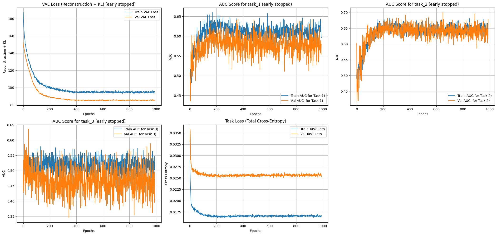

[](https://github.com/xuxu-wei/SUAVE/blob/main/%E4%BD%BF%E7%94%A8%E8%AF%B4%E6%98%8E-%E4%B8%AD%E6%96%87%E7%89%88.md)  

# SUAVE: Supervised and Unified Analysis of Variational Embeddings

**SUAVE** is a Python package built upon a **Hybrid Variational Autoencoder (VAE)** integrated with Multi-Task Learning. It unifies unsupervised latent representation learning with supervised prediction tasks. By guiding the latent space with label information, SUAVE not only achieves dimensionality reduction but also yields discriminative and interpretable embeddings that directly benefit downstream classification or regression tasks.

---

## Installation

**Please Note** This package requires PyTorch. Please install the appropriate version of PyTorch for your system using the [official PyTorch guide](https://pytorch.org/get-started/locally/). By default, SUAVE will detect the system environment during installation and automatically install a suitable PyTorch version, but this feature has not been thoroughly tested.

- Install from Pypi

```bash
pip install suave-ml
```

---

## Quick Start

### 1. Prepare Your Data (Here, Randomly Generated Data is Used as an Example)

```python
from suave.utils import make_multitask_classification
X_train, X_test, Y_train, Y_test = make_multitask_classification(random_state=123)
```

---

### 2. Define and Train the Model

```python
from suave import SuaveClassifier

# Instantiate the model
model = SuaveClassifier(input_dim=X_train.shape[1],                                             # Input feature dimension
                        task_classes=[len(Y_train[col].unique()) for col in Y_train.columns],   # Number of binary classification tasks
                        latent_dim=20                                                           # Latent dimension
                        )

# Fit the model on training data
model.fit(X_train, Y_train, epochs=1000, animate_monitor=True, verbose=1)
```



```
Training:  31%|███       | 306/1000 [02:55<06:38,  1.74epoch/s, VAE(t)=217.777, VAE(v)=197.522, AUC(t)=[0.975, 0.977, 0.988], AUC(v)=[0.85, 0.808, 0.923]] 
Epoch 307: Task task_2 early stopping triggered.
Early stopping triggered due to no improvement in both VAE and task losses.
```

---

### 3. Make Predictions

```python
# Make predictions on test data
y_probas = model.predict_proba(X_test)
y_hats = model.predict(X_test)

auc_scores = model.score(X_test, Y_test)
print("AUC Scores:", auc_scores)
```

```
AUC Scores: [0.84756281 0.8265501  0.90290179]
```

---

### 4. Transform Features to Latent Space

```python
latent_features = model.transform(np.array(X_test))
X_latent = pd.DataFrame(latent_features, index=X_test.index, columns=[f'latent_feature {i+1}' for i in range(10)]) # number of columns should be the same as `latent_dim`
```

---

### 5. Reconstruct inputs from latent space

```python
reconstructed = model.inverse_transform(latent_features)
X_reconstructed = pd.DataFrame(reconstructed, index=X_test.index, columns=X_test.columns)
```

---
## Key Features

### 1. Supervised & Unsupervised Fusion

- **Unsupervised (VAE)**: Learns a latent space representation by reconstructing input features and regularizing the latent variables using a Kullback-Leibler (KL) divergence term.
- **Supervised (MTL)**: Incorporates label information to shape the latent space, ensuring that the learned features are informative for one or multiple prediction tasks.

### 2. Multi-Task Learning Integration

- **Shared Representations**: A single latent space underpins multiple related classification (or other) tasks, leveraging common data structure for efficient, joint learning.
- **Task-Specific Heads**: Independent prediction heads are built atop the shared latent space. This encourages knowledge transfer among tasks and can improve predictive performance on each one.

### 3. Flexible and Customizable Architecture

- **Configurable Networks**: Easily adjust encoder and decoder depths, widths, and layer scaling strategies (e.g., constant, linear, geometric).
- **Regularization Built-In**: Batch normalization and dropout help stabilize training and mitigate overfitting.

### 4. Scikit-Learn Compatibility

- **Seamless Integration**: The `SuaveSklearn` class is compatible with scikit-learn’s pipeline and model selection APIs. Perform hyperparameter tuning with `GridSearchCV` and integrate SUAVE models into complex ML workflows with minimal friction.

### 5. Comprehensive Training Utilities

- **Joint Objective Optimization**: Simultaneously optimizes the VAE reconstruction/KL losses and supervised cross-entropy losses.
- **Early Stopping & LR Scheduling**: Monitors validation metrics for early stopping and dynamically adjusts learning rates to ensure stable convergence.

---

## Example Use Cases

- **Supervised Dimensionality Reduction**: Obtain a low-dimensional feature representation that preserves predictive signals for classification tasks.
- **Multi-Task Classification**: Tackle multiple related outcomes (e.g., multiple mortality endpoints) within a unified model and benefit from shared latent factors.
- **Generative Modeling & Data Insight**: Interpolate, generate synthetic samples, and visualize latent structures that capture underlying data patterns and decision boundaries.

---


## License

This project is licensed under the **BSD 3-Clause License** . See the `LICENSE` file for details.
